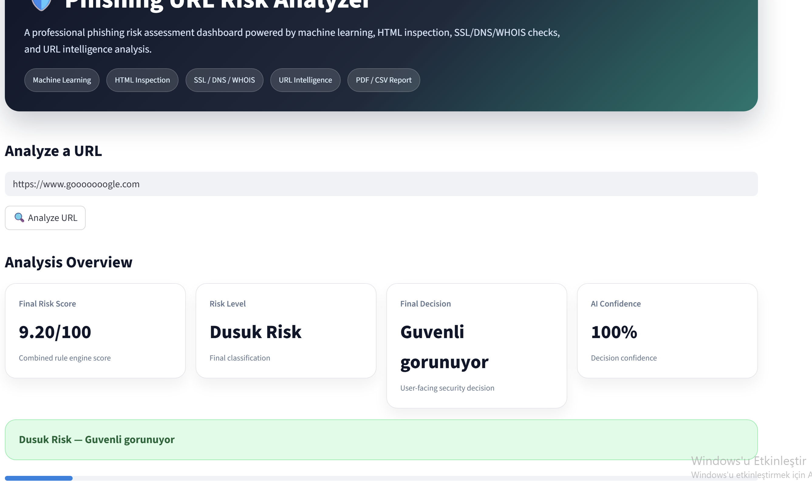
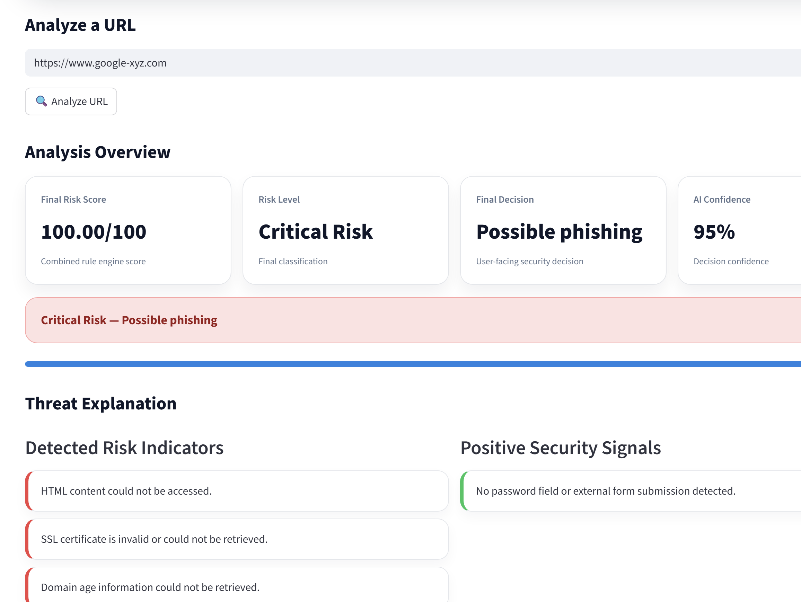
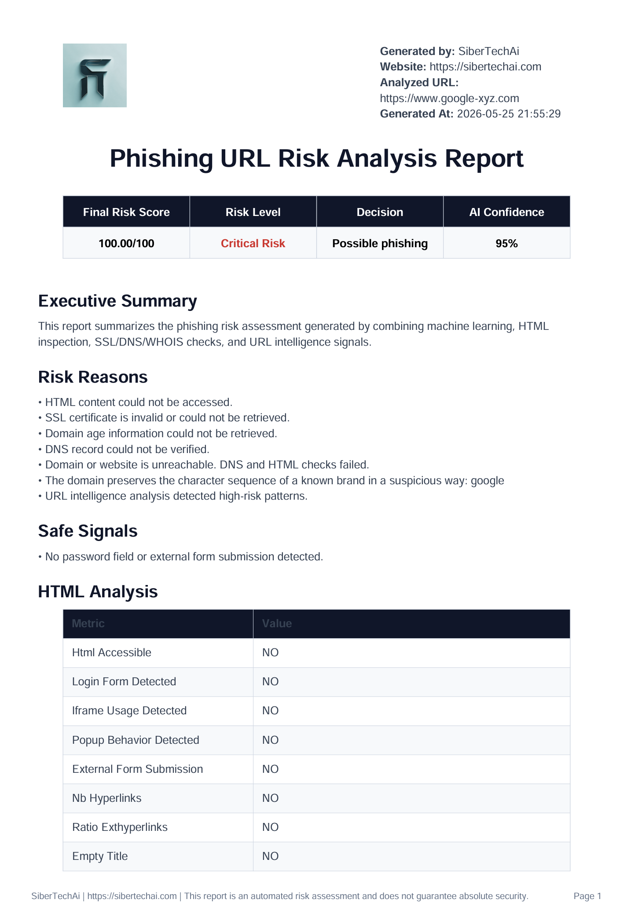

# Phishing URL Risk Analyzer

A professional phishing risk assessment dashboard powered by machine learning, HTML inspection, SSL/DNS/WHOIS checks, and URL intelligence analysis.

## Features

- Machine learning based URL risk prediction
- Live HTML structure inspection
- SSL certificate validation
- DNS availability check
- WHOIS/domain age analysis
- URL intelligence and brand impersonation detection
- Final risk scoring engine
- PDF and CSV report export
- Streamlit-based professional dashboard UI

## Project Structure

```text
phishing-url-risk-analyzer/
├── app/
│   ├── streamlit_app.py
│   ├── url_features.py
│   ├── html_features.py
│   ├── network_features.py
│   ├── intelligence_features.py
│   ├── risk_engine.py
│   ├── model_service.py
│   ├── report_service.py
│   ├── report_formatter.py
│   └── static/
│       └── logo.png
├── assets/
│   └── logo.png
├── models/
│   ├── xgboost_live_url_model.joblib
│   └── live_url_feature_columns.joblib
├── data/
├── notebooks/
├── requirements.txt
├── .gitignore
└── README.md


Installation

pip install -r requirements.txt


Run the App

streamlit run app/streamlit_app.py


Disclaimer

This tool provides automated risk assessment support and does not guarantee absolute security. Suspicious URLs should also be verified using independent security sources.


## Screenshots

### Main Dashboard



---

### Critical Risk Detection



---

### PDF Report Export




## Author

Developed by SiberTechAi

Website:
https://sibertechai.com